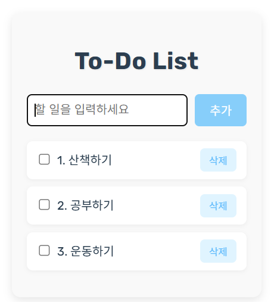

리액트 투두 앱 만들기

# 📝 ToDo List App

간단하고 직관적인 할 일 관리 웹 애플리케이션입니다.  
React 기반으로 제작되었으며, 로컬 스토리지를 통해 사용자의 데이터를 저장합니다.

---

## 📌 기술 스택

- React
- JavaScript
- CSS Modules
- localStorage

---

## ✔️ 주요 기능

- 할 일 추가
- 할 일 삭제
- 완료 체크/해제
- localStorage 저장 및 동기화

---

## 🗂️ 프로젝트 구조

src
├── components/
│ ├── ToDoItem.jsx
│ ├── ToDoList.jsx
│ └── ToDoWriteForm.jsx
├── context/
│ └── ToDoContext.jsx
├── util/
│ └── storage.js
├── App.jsx
├── App.css
├── index.css
└── main.jsx

---

## 💻 미리보기

---

## 🚀 시작하기

npm install
npm run dev
